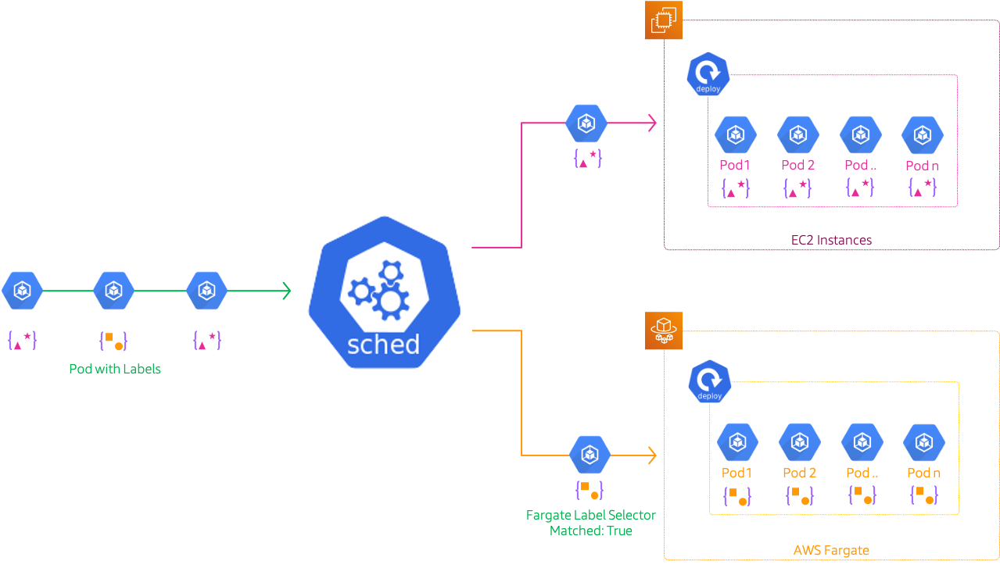

# Kubernetes Pods on Fargate

The developer at Mystique Unicorn are interested in building their application using event-driven architectural pattern to process streaming data. For those who are unfamiliar, _An event-driven architecture uses events to trigger and communicate between decoupled services and is common in modern applications built with microservices. An event is a change in state, or an update, like an item being placed in a shopping cart on an e-commerce website._

In this application, Kubernetes has been chosen as the platform to host their application producing and consuming events. The developers do not want to worry about patching, scaling, or securing a cluster of EC2 instances to run Kubernetes applications in the cloud. They are looking for a low-overhead mechanism to run their pods.

Can you help them?



## 🎯 Solutions

AWS Fargate<sup>[1]</sup> is a serverless compute engine for containers that works with Amazon Elastic Kubernetes Service (EKS). Fargate reliminates the need for customers to create or manage EC2 instances for their Amazon EKS clusters. Using Fargate, customers define and pay for resources at the pod-level. This makes it easy to right-size resource utilization for each application and allow customers to clearly see the cost of each pod.

Fargate allocates the right amount of compute, eliminating the need to choose instances and scale cluster capacity. You only pay for the resources required to run your containers, so there is no over-provisioning and paying for additional servers. Fargate runs each task or pod in its own kernel providing the tasks and pods their own isolated compute environment. This enables your application to have workload isolation and improved security by design.

We must define at least one Fargate profile to schedule pods on Fargate. launched. The Fargate profile allows an administrator to declare which pods run on Fargate. This declaration is done through the profile’s selectors. Each profile can have up to five selectors that contain a namespace and optional labels. You must define a namespace for every selector.

**NOTE**: Pods are selected by matching a `namespace` for the selector and **ALL** of the `labels` specified in the selector.

In this blog, I will show how to deploy a simple application using Amazon EKS on Fargate.

1. ## 🧰 Prerequisites

   This demo, instructions, scripts and cloudformation template is designed to be run in `us-east-1`. With few modifications you can try it out in other regions as well(_Not covered here_).

   - 🛠 AWS CLI Installed & Configured - [Get help here](https://youtu.be/TPyyfmQte0U)
   - 🛠 AWS CDK Installed & Configured - [Get help here](https://www.youtube.com/watch?v=MKwxpszw0Rc)
   - 🛠 Python Packages, _Change the below commands to suit your OS, the following is written for amzn linux 2_
     - Python3 - `yum install -y python3`
     - Python Pip - `yum install -y python-pip`
     - Virtualenv - `pip3 install virtualenv`

1. ## ⚙️ Setting up the environment

   - Get the application code

     ```bash
     git clone https://github.com/miztiik/eks-with-fargate-pods
     cd eks-with-fargate-pods
     ```

1. ## 🚀 Prepare the dev environment to run AWS CDK

   We will use `cdk` to make our deployments easier. Lets go ahead and install the necessary components.

   ```bash
   # You should have npm pre-installed
   # If you DONT have cdk installed
   npm install -g aws-cdk

   # Make sure you in root directory
   python3 -m venv .venv
   source .venv/bin/activate
   pip3 install -r requirements.txt
   ```

   The very first time you deploy an AWS CDK app into an environment _(account/region)_, you’ll need to install a `bootstrap stack`, Otherwise just go ahead and deploy using `cdk deploy`.

   ```bash
   cdk bootstrap
   cdk ls
   # Follow on screen prompts
   ```

   You should see an output of the available stacks,

   ```bash
   eks-cluster-vpc-stack
   eks-cluster-stack
   ssm-agent-installer-daemonset-stack
   ```

1. ## 🚀 Deploying the application

   Let us walk through each of the stacks,

   - **Stack: eks-cluster-vpc-stack**
     To host our EKS cluster we need a custom VPC. This stack will build a multi-az VPC with the following attributes,

     - **VPC**:
       - 2-AZ Subnets with Public, Private and Isolated Subnets.
       - 1 NAT GW for internet access from private subnets

     Initiate the deployment with the following command,

     ```bash
     cdk deploy eks-cluster-vpc-stack
     ```

     After successfully deploying the stack, Check the `Outputs` section of the stack.

   - **Stack: eks-cluster-stack**
     As we are starting out a new cluster, we will use most default. No logging is configured or any add-ons. The cluster will have the following attributes,

     - The control pane is launched with public access. _i.e_ the cluster can be access without a bastion host
     - `c_admin` IAM role added to _aws-auth_ configMap to administer the cluster from CLI.
     - One **OnDemand** managed EC2 node group created from a launch template
       - It create two `t3.medium` instances running `Amazon Linux 2`
       - Auto-scaling Group with `2` desired instances.
       - The nodes will have a node role attached to them with `AmazonSSMManagedInstanceCore` permissions
       - Kubernetes label `app:miztiik_on_demand_ng`
     - One **Fargate Profile**
       - **Namespace**: `fargate-ns-01`
       - **Labels**:
         1. `owner:miztiik_automation`
         1. `compute_provider:fargate`

     In this demo, let us launch the EKS cluster in a custom VPC using AWS CDK. Initiate the deployment with the following command,

     ```bash
     cdk deploy eks-cluster-stack
     ```

     After successfully deploying the stack, Check the `Outputs` section of the stack. You will find the `*ConfigCommand*` that allows yous to interact with your cluster using `kubectl`

   - **Stack: ssm-agent-installer-daemonset-stack**
     This EKS AMI used in this stack does not include the AWS SSM Agent out of the box. If we ever want to patch or run something remotely on our EKS nodes, this agent is really helpful to automate those tasks. We will deploy a daemonset that will _run exactly once?_ on each node using a cron entry injection that deletes itself after successful execution. If you are interested take a look at the daemonset manifest here `stacks/back_end/eks_cluster_stacks/eks_ssm_daemonset_stack/eks_ssm_daemonset_stack.py`. This is inspired by this AWS guidance.

     Initiate the deployment with the following command,

     ```bash
     cdk deploy ssm-agent-installer-daemonset-stack
     ```

     After successfully deploying the stack, You can connect to the worker nodes instance using SSM Session Manager.

1. ## 🔬 Testing the solution

   We are all set with our cluster to deploy our pods.

   1. **Create Fargate Pods**

      To refresh our thoughts, To schedule pods on Fargate, The scheduler does a match of `namespace` and **ALL** the labels for that selector. While deploying the `eks-cluster-stack` stack we bootstrapped our cluster with a fargate profile with the following configuration,

      - One **Fargate Profile**
        - **Namespace**: `fargate-ns-01`
        - **Labels**:
          1. `owner:miztiik_automation`
          1. `compute_provider:fargate`

      We will define this in our manifest as well. I have included a sample manifest here `stacks/k8s_utils/sample_manifests/nginx_on_fargate.yml`. In the manifest, you can observe that we can mentioned the same namespace and the labels are same as the fargate profile.

      _Note: If the labels do not match and if you have a EC2 node group, then EKS will schedule the pods on EC2_

      ```text
      apiVersion: apps/v1
      kind: Deployment
      metadata:
        name: k-shop-01
        namespace: fargate-ns-01
        labels:
          app: k-shop-01
      spec:
        replicas: 3
        selector:
          matchLabels:
            owner: miztiik_automation
            compute_provider: fargate
        template:
          metadata:
            labels:
              owner: miztiik_automation
              compute_provider: fargate
          spec:
            containers:
              - name: k-shop-nginx
                image: nginx:latest
                ports:
                  - name: http
                    containerPort: 80
      ```

      Deploy the manifest,

      ```bash
      kubectl apply -f nginx_on_fargate.yml
      ```

      Verify the pods are running on fargate,

      ```bash
      kubectl get po -n fargate-ns-01
      ```

      Expected output,

      ```bash
      NAME                         READY   STATUS    RESTARTS   AGE
      k-shop-01-67947b487c-fhvq2   1/1     Running   0          3m15s
      k-shop-01-67947b487c-l86f8   1/1     Running   0          3m15s
      k-shop-01-67947b487c-zxqz4   1/1     Running   0          3m15s
      ```

      Check the nodes on the cluster

      ```bash
      kubectl get no -n fargate-ns-01
      ```

      Expected output,

      ```bash
      NAME                                                STATUS   ROLES    AGE   VERSION
      fargate-ip-10-10-2-187.us-east-2.compute.internal   Ready    <none>   3m1s    v1.20.4-eks-6b7464
      fargate-ip-10-10-3-101.us-east-2.compute.internal   Ready    <none>   3m4s    v1.20.4-eks-6b7464
      fargate-ip-10-10-3-86.us-east-2.compute.internal    Ready    <none>   2m43s   v1.20.4-eks-6b7464
      ```

1. ## 📒 Conclusion

   Here we have demonstrated how to use Fargate to schedule your pods. As much as fargate reduces administrative burden, there are few things application owners need to consider before committing to Fargate<sup>[2]</sup>

1. ## 🧹 CleanUp

   If you want to destroy all the resources created by the stack, Execute the below command to delete the stack, or _you can delete the stack from console as well_

   - Resources created during [Deploying The Application](#-deploying-the-application)
   - Delete CloudWatch Lambda LogGroups
   - _Any other custom resources, you have created for this demo_

   ```bash
   # Delete from cdk
   cdk destroy

   # Follow any on-screen prompts

   # Delete the CF Stack, If you used cloudformation to deploy the stack.
   aws cloudformation delete-stack \
     --stack-name "MiztiikAutomationStack" \
     --region "${AWS_REGION}"
   ```

   This is not an exhaustive list, please carry out other necessary steps as maybe applicable to your needs.

## 📌 Who is using this

This repository aims to show how to schedule pods on AWS Fargate to new developers, Solution Architects & Ops Engineers in AWS. Based on that knowledge these Udemy [course #1][102], [course #2][101] helps you build complete architecture in AWS.

### 💡 Help/Suggestions or 🐛 Bugs

Thank you for your interest in contributing to our project. Whether it is a bug report, new feature, correction, or additional documentation or solutions, we greatly value feedback and contributions from our community. [Start here](/issues)

### 👋 Buy me a coffee

[](https://ko-fi.com/Q5Q41QDGK) Buy me a [coffee ☕][900].

### 📚 References

1. [AWS Docs: Fargate][1]
1. [AWS Docs: Fargate Considerations][2]

### 🏷️ Metadata


**Level**: 200

[1]: https://aws.amazon.com/fargate
[2]: https://docs.aws.amazon.com/eks/latest/userguide/fargate.html#fargate-considerations
[100]: https://www.udemy.com/course/aws-cloud-security/?referralCode=B7F1B6C78B45ADAF77A9
[101]: https://www.udemy.com/course/aws-cloud-security-proactive-way/?referralCode=71DC542AD4481309A441
[102]: https://www.udemy.com/course/aws-cloud-development-kit-from-beginner-to-professional/?referralCode=E15D7FB64E417C547579
[103]: https://www.udemy.com/course/aws-cloudformation-basics?referralCode=93AD3B1530BC871093D6
[899]: https://www.udemy.com/user/n-kumar/
[900]: https://ko-fi.com/miztiik
[901]: https://ko-fi.com/Q5Q41QDGK
